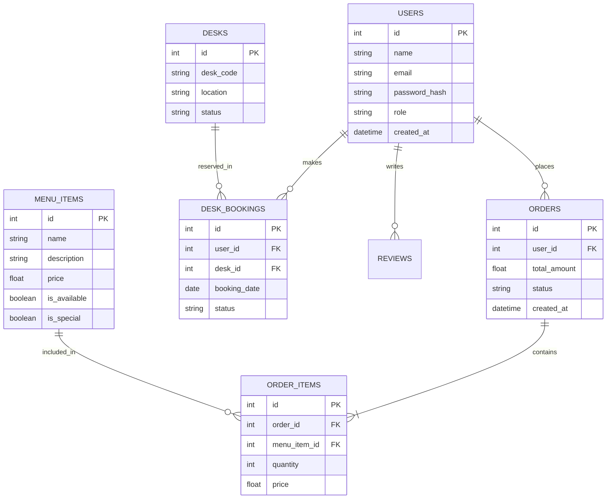

# Cafeteria Management & Desk Booking System

A comprehensive web application for managing office cafeteria orders and desk bookings. This system streamlines the process of ordering food and reserving workspaces for employees, with a dedicated admin dashboard for management.

## 🚀 Project Overview

This full-stack application provides the following key features:
-   **Authentication & Roles**: Secure login/signup for Employees and Admins (Cafeteria & Desk Admins).
-   **Cafeteria Management**:
    -   Employees can browse the menu, filter items, and place food orders.
    -   Cafeteria Admins can manage menu items (add/update/delete/specials) and process orders (update status).
-   **Desk Booking**:
    -   Employees can view available desks and book them for specific dates.
    -   Desk Admins can manage desk inventory and view all bookings.
-   **Dashboard**:
    -   Daily summaries of orders and bookings.
    -   Visual statistics for admins (revenue, item demand, desk utilization).

## 🛠️ Tech Stack

### Backend
-   **Framework**: Python (Flask)
-   **Database**: PostgreSQL
-   **ORM**: SQLAlchemy
-   **Authentication**: Flask-JWT-Extended (Stateless JWT)
-   **API Documentation**: Swagger UI (available at `/docs`)

### Frontend
-   **Framework**: React (Vite)
-   **Styling**: Tailwind CSS, Lucide React (Icons)
-   **State/Data**: Axios for API requests

### Infrastructure
-   **Containerization**: Docker, Docker Compose

---

## ⚙️ Setup and Run Instructions

### 1. Prerequisite
-   Docker & Docker Compose (Recommended)
-   OR Python 3.10+ and Node.js 18+ (for local manual setup)

### 2. Run using Docker (Recommended)
This is the easiest way to run the full stack (Frontend + Backend + Database).

1.  **Clone the repository:**
    ```bash
    git clone https://github.com/AakankshaVora/Cafeteria_management-desk_booking-.git
    cd Cafeteria_management-desk_booking-
    git checkout frontend  # Ensure you are on the correct branch
    ```

2.  **Start the application:**
    ```bash
    docker compose up --build
    ```

3.  **Access the App:**
    -   **Frontend**: http://localhost:5173
    -   **Backend API**: http://localhost:5000
    -   **Swagger Docs**: http://localhost:5000/docs
    -   **Database (pgAdmin)**: Connect to `localhost` port `5433` (User: `postgres`, Pass: `newpassword123`).

4.  **Seed Data (First Time Only):**
    If the database is empty, run:
    ```bash
    docker compose exec backend python seed_db.py
    ```

### 3. Run Locally (Manual)

#### Backend
1.  Navigate to backend: `cd Cafeteria_Desk_Backend`
2.  Create virtual env: `python3 -m venv venv`
3.  Activate env: `source venv/bin/activate` (Linux/Mac) or `venv\Scripts\activate` (Win)
4.  Install deps: `pip install -r requirements.txt`
5.  Set Environment Variables in `.env` (see `.env.example`).
6.  Run: `flask run`

#### Frontend
1.  Navigate to frontend: `cd Cafeteria_Desk_Frontend`
2.  Install deps: `npm install`
3.  Run: `npm run dev`

---

## 📡 API Endpoints

### Authentication
| Method | Endpoint | Description | Auth |
| :--- | :--- | :--- | :--- |
| `POST` | `/auth/login` | Login user | Public |
| `POST` | `/auth/register` | Register new user (Employee only) | Public |
| `POST` | `/auth/logout` | Logout user | User |
| `GET` | `/auth/profile` | Get current user details | User |

### Menu Management
| Method | Endpoint | Description | Auth |
| :--- | :--- | :--- | :--- |
| `GET` | `/menu` | Get all menu items (support `?q=` search) | User |
| `POST` | `/menu` | Add new menu item | Admin |
| `PUT` | `/menu/update/<id>` | Update menu item | Admin |
| `DELETE` | `/menu/delete/<id>` | Delete menu item | Admin |
| `PUT` | `/menu/<id>/special` | Set Today's Special | Admin |

### Order Management
| Method | Endpoint | Description | Auth |
| :--- | :--- | :--- | :--- |
| `POST` | `/orders` | Place a food order | Employee |
| `GET` | `/orders/my` | View my orders | Employee |
| `GET` | `/orders` | View all orders | Admin |
| `PUT` | `/orders/<id>/status` | Update order status (pending/completed) | Admin |
| `GET` | `/orders/stats` | View daily order statistics | Admin |

### Desk Booking
| Method | Endpoint | Description | Auth |
| :--- | :--- | :--- | :--- |
| `GET` | `/desks` | View all desks and availability | User |
| `POST` | `/desk-bookings` | Book a desk | Employee |
| `GET` | `/desk-bookings/my` | View my bookings | Employee |
| `GET` | `/desk-bookings/all` | View all bookings | Admin |
| `DELETE` | `/desk-bookings/<id>` | Cancel specific booking | User/Admin |

---

## 📊 Database Diagram

### Entity Relationship Diagram (ERD)



### Sample Credentials

| Role | Email | Password |
| :--- | :--- | :--- |
| **Employee** | `employee@example.com` | `employee123` |
| **Cafeteria Admin** | `admin@example.com` | `admin123` |
| **Desk Admin** | `deskadmin@example.com` | `deskadmin123` |

---
**Note:** Ensure you are using the correct port for the database (`5433` for Docker, `5432` for Local) when verifying data.
